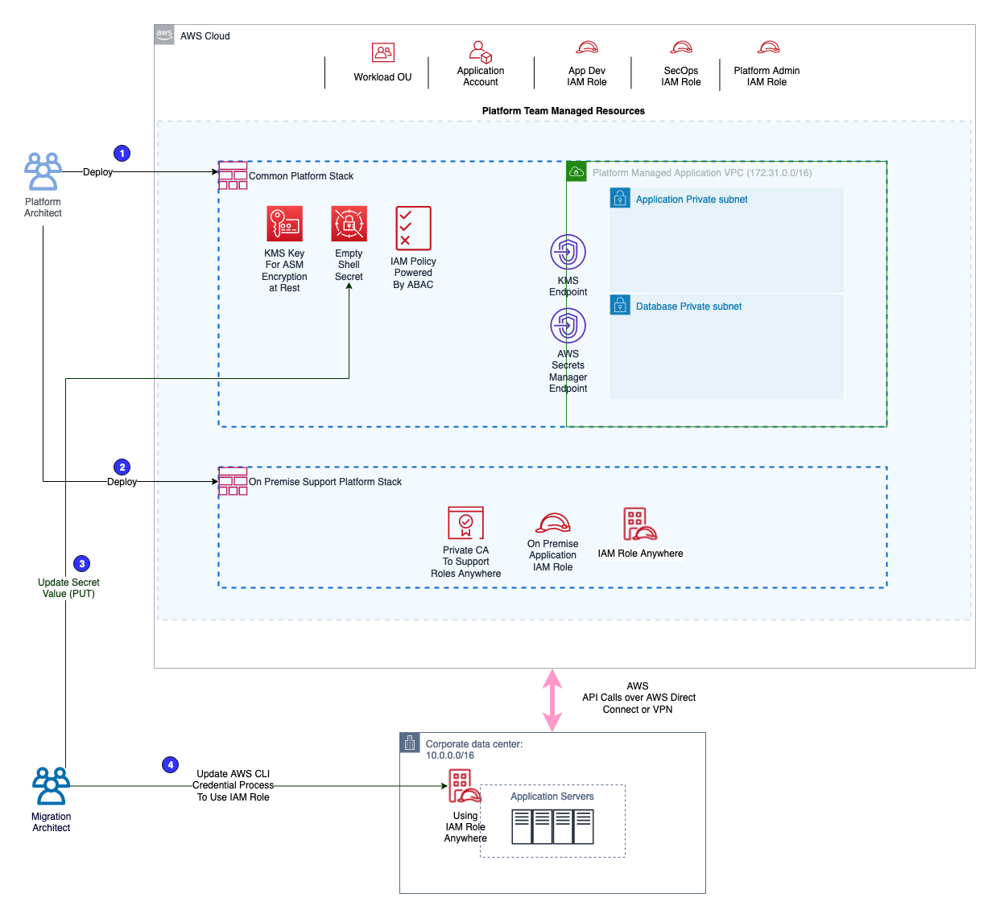
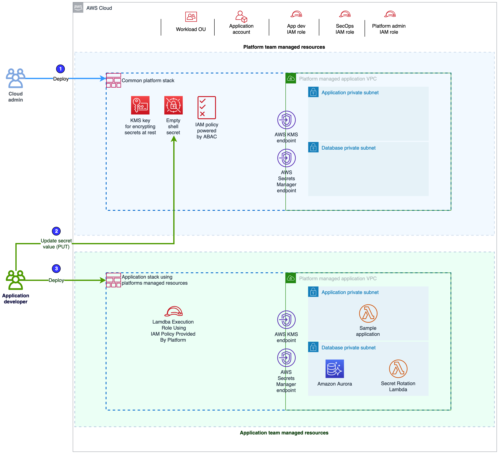

### Sample CDK patterns using Attribute-Based Access Control (ABAC) authorization to access AWS Secrets Manager 

***Application hosted on premises utilize `IAM Role Anywhere` and authorize using `ABAC`.***

***Or***

***Application hosted on `EC2 Instances`,`Lambda` etc utilize `IAM Roles` and authorize using `ABAC`.***

Project: `aws-secrets-manager-abac-authorization-samples`

## Prerequisite

Please make sure the following software packages are installed in your environment before the deployment:

-   Node.js v12 or above (https://nodejs.org)
-   AWS CLI version 2 (https://docs.aws.amazon.com/cli/latest/userguide/welcome-versions.html)
-   jq (https://stedolan.github.io/jq/)
-   git (https://git-scm.com/)
-   openssl (https://www.openssl.org/)

## Solution Overview

Enterprises migrate applications regularly by partnering with in-house application and cloud platform teams, AWS Professional Services, or AWS Partner Network. Migration team often met with friction from cybersecurity teams and governance program to mitigate the risks to protect your company and customers. The key challenge is to keep up to date on the standards with a continuous capability to build and review the controls enforcement. One of the answer is to introduce security automation.

In this solution, we will walk through the steps required to migrate a create a sensitive asset like secrets which is *secure-by-default* using attribute-Based Access Control (ABAC). n AWS, these attributes are called tags. You can attach tags to IAM resources, including IAM entities (users or roles), and to AWS resources (AWS Secrets Manager). You can create a single ABAC policy or small set of policies for your IAM principals. Refer to *Figure-2: ABAC Access Control*.

The proposed solution enables *Platform Engineer* implemented IT controls recommended by *Security Architect*, which enhance security posture of migrating applications. This solution comprises the following main components to show **Attribute Based Access Control (ABAC)** workflow for sensitive assets management like secrets:

- Enforce the following `tagging` schema which is dictated by *Security Architect* persona and implemented *Platform Engineer* persona, for example:

```
{
    “name”: “<Identifier for the secret material within ASM>“,
    “appid”: “<A unique identifier that could potential be used to correlate with other AWS services.”,
    “appfunc”: “<Used to describe the function of a particular target that the secret material is associated (eg web server, message broker, database)>“,
    “appenv”: “<An identifier for the secret usage environment (e.g. dev, test, nonp, prod)>“,
    “dataclassification”: “<Long term secrets/keys data classification within the organisation (e.g. protected, confidential )>“
}

```

- A **common platform infrastructure stack**, for *Platform Engineer* persona which deploys:
    - An empty shell secret, tagged supplied attributes and an IAM managed policy using attributes.
    - A sample Amazon Virtual Private Cloud (Amazon VPC) with `PUBLIC`, `PRIVATE_WITH_NAT` and `PRIVATE_ISOLATED` subnet type.
    - Attach VPC endpoints for KMS and AWS Secrets Manager service to above VPC.

- A **IAM roles anywhere infrastructure stack**, for the *Platform Engineer* persona, which deploys:
    - AWS Certificate Manager Private Certificate Authority (ACM PCA)
    - IAM Role Anywhere PKI trust anchor using ACM PCA
    - IAM Role for on-premises application using **common platform infrastructure stack**
    - IAM Role Anywhere profile

- A **client side utility**, for the *Migration engineer* persona for IAM Role Anywhere consumption:
    - Walks user through private certificate request process using *openssl*.
    - Uses [aws_signing_helper (Credential Helper)](https://docs.aws.amazon.com/rolesanywhere/latest/userguide/credential-helper.html) to setup AWS CLI profiles using `credential_process` for the IAM role anywhere consumption.

- A **Sample application stack**, for the *Migration engineer* persona to show ABAC authorisation from a sample lambda application:
    - It uses VPC deployed **common platform infrastructure stack**.
    - Deploys a *AuroraMysql* serverless cluster in `PRIVATE_ISOLATED` subnet and uses the secret created via **common platform stack**.
    - Deploys a sample lambda in `PRIVATE_WITH_NAT` subnet.
    - Deploy two IAM:
        - *allowedRole* (default role): when the application uses this role, it’s able `GET` the secret and open connection to the aurora MySQL database.
        - *Not allowedRole*: when application uses this role, its unable use `GET` the secret and open connection to the aurora MySQL database.

## Architecture and Deployment Steps

Before deployment, please make sure that the correct AWS credentials are configured in your terminal session. It can be in the environment variables or in `~/.aws`. More details, please refer to [Configuring the AWS CLI](https://docs.aws.amazon.com/cli/latest/userguide/cli-chap-configure.html).

Kindly ensure following pre-requisite are configured before deploying the CDK apps. 

-   Set your AWS Credentials to deploy the stack

```
export AWS_ACCESS_KEY_ID=<>
export AWS_SECRET_ACCESS_KEY=<>
export AWS_REGION = <>
```

Additionally, [CDK Toolkit](https://docs.aws.amazon.com/cdk/index.html) stack will be created by cdk bootstrap and will manage resources necessary to enable deployment of Cloud Applications with AWS CDK.

```
cdk bootstrap aws://<AWS Account Number>/<Region> # Bootstrap CDK in the specified account and region
```

#### Archetype: Migrating application is currently on premises

##### Requirement

- Application is currently hosted in on-premises.
- Application would consume API keys, credential stored etc stored in AWS Secrets Manager. 

##### Workflow

- *Application Team* confirms the tagging requirement with the security team and provides information to *platform team*.
- *Platform engineer* deploys a **common platform infrastructure stack** to bootstrap the AWS account with secrets and IAM policy using tagging requirement supplied. 
- Additionally, *Platform engineer* deploys **IAM roles anywhere infrastructure stack**. 
- *Application developer* updates the secrets required by the application using **client side utility** (helper.sh).
- *Application developer* uses **client side utility** to update the AWS CLI profile to consume IAM role anywhere role from on-premises servers.



##### Deployment Steps

- **Step-1 (*Application Team*):** Clone the repository and update *tagging* details at `configs/tagconfig.json`.

> Note: Do not modify the tag/attributes `name/key`, only modify the `value`.

- **Step-2a (*Platform engineer*):** Run the following command to deploy **common platform infrastructure stack**:
```
 ./helper.sh prepare
```

- **Step-2b (*Platform engineer*):** Run the following command to deploy **IAM roles anywhere infrastructure stack**:
```
./helper.sh on-prem
```

- **Step-3a (*Application developer*):** Update the secret value of the dummy secrets provided by the platform team. Use the following command:
```
 ./helper.sh update-secret
```

> Note: Above command will only update secret if its still using dummy value.

- **Step-3b (*Application developer*):** Run the following command to setup the client/server on premises:
```
./helper.sh client-profile-setup
```

Follow the command prompt, it would help you request a client certificate and update the AWS CLI profile. 

> Note: 
    - For client certificate make sure to supply at-least one Distinguished Name like `Common Name`.
    - `~/.aws` folder would be used to store the certificate and credential tool.

Sample output should be like this:

```
--> Assume role worked and arn:aws:sts::1234567891012:assumed-role/RolesanywhereabacStack-onPremAppRole-xxx
    can be used by the application using AWS CLI profile 'developer'. 
```

### Archetype: Application has migrated to AWS Cloud

##### Requirement

- Deploy a sample application to demonstrate how ABAC authorization for AWS Secrets Manager APIs.
- Deploy a sample application with best practices as code. 

##### Workflow

- *Application Team* confirms the tagging requirement with the security team and provide information to *platform team*. 
- *Platform engineer* deploys a **common platform infrastructure stack** to bootstrap the AWS account with secrets and IAM policy using tagging requirement supplied. 
- *Application developer* updates the secrets required by the application using **client side utility** (helper.sh).
- *Application developer* test the sample application to confirm attribute-Based Access Control (ABAC). 




##### Deployment Steps

- **Step-1 (*Application Team*):** Clone the repository and update *tagging* details at `configs/tagconfig.json`.

> Note: Do not modify the tag/attributes `name/key`, only modify the `value`.

- **Step-2 (*Platform engineer*):** Run the following command to deploy **common platform infrastructure stack**:
```
 ./helper.sh prepare
```

- **Step-3a (*Application developer*):** Update the secret value of the dummy secrets provided by the platform team. Use the following command:
```
 ./helper.sh update-secret
```

> Note: Above command will only update secret if its still using dummy value.

- **Step-3b (*Application developer*):** Run the following command to deploy **sample app stack**:
```
./helper.sh on-aws
```

## Contributors

```
Eric Swamy, Senior Security Consultant, AWS Professional Services
Adesh Gairola, Senior Security Consultant, AWS Professional Services
```

## Security

See [CONTRIBUTING](CONTRIBUTING.md#security-issue-notifications) for more information.

## License

This library is licensed under the MIT-0 License. See the LICENSE file.
